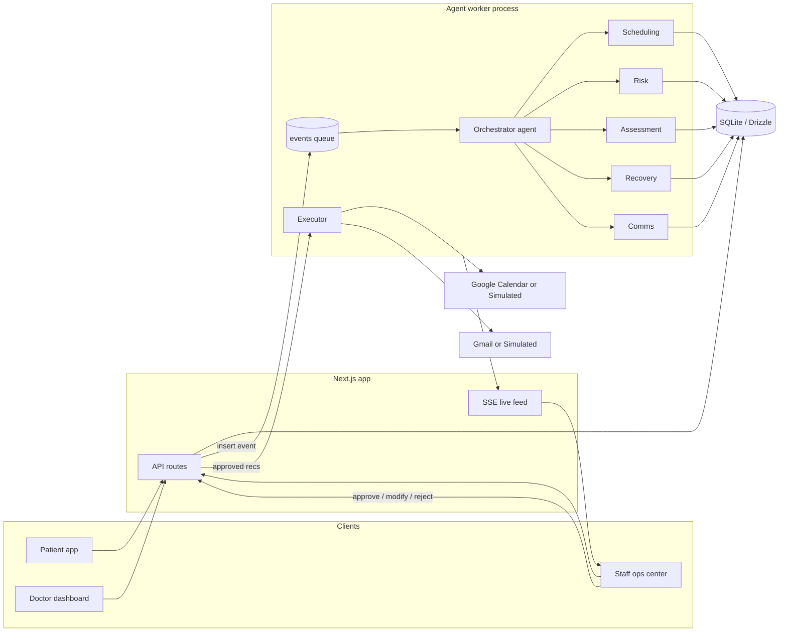

# ARCHITECTURE.md — SchediCare

## 1. Design principles

1. **Deterministic core, agentic shell.** Anything that must be *correct* (slot availability, conflicts, capacity, rule compliance) is a pure function. Anything that must be *smart* (routing, prioritization, drafting, interpreting humans) is an LLM agent that can only act through those functions. The LLM never invents a time slot; it can only choose among validated ones.
2. **Everything is a case.** A disruption becomes a `case` row with a strict state machine. Agents advance cases; they cannot skip states. Humans own the `awaiting_approval → executing` transition.
3. **No unapproved side effects.** External writes (calendar mutation, message send) live exclusively in the Executor, which only consumes **approved** recommendations.
4. **Two providers for every integration.** `google` and `simulated` implement the same interface. The system cannot tell the difference; the demo cannot be killed by OAuth.
5. **Observability is a feature.** Every agent step is persisted and streamed. The audit log is the same data that powers the live feed and the replay scrubber.

## 2. System overview



Two processes:

- **Next.js app** — UI, CRUD, trigger ingestion (`POST /api/events`), approval endpoints, SSE feed.
- **Worker** (`worker/index.ts`, plain Node via `tsx`) — polls the `events` table, runs the Orchestrator, runs sub-agents, runs the Executor for approved recommendations. DB-backed queue means no Redis, survives restarts, and every message is inspectable — ideal for a capstone.

## 3. Trigger model

| Class | Examples | Entry point |
|---|---|---|
| Manual | patient books/cancels/reschedules; staff reports issue; doctor marks unavailable | UI → `POST /api/events` |
| Scheduled | daily sweep: unconfirmed check, no-show risk review, capacity imbalance, waitlist-fill scan | `worker` cron tick → synthetic events |
| Event-driven | calendar change webhook/poll; patient reply received; capacity threshold crossed; slot vacated | provider poller → events |

All three converge on one table: `events(id, type, payload, status, created_at)`. Uniform ingestion is what makes the agent layer simple.

## 4. Case state machine

```
open ──► assessing ──► planning ──► awaiting_approval ──► executing ──► resolving ──► resolved
  │                                        │                              │
  └────────────► escalated ◄───────────────┴──────────────────────────────┘
```

- `assessing` — Assessment agent computes blast radius, severity, priority list.
- `planning` — Scheduling + Recovery agents produce validated, ranked recommendations; Comms drafts messages.
- `awaiting_approval` — **hard stop.** Only a staff decision moves the case.
- `executing` — Executor applies approved calendar writes / sends approved messages.
- `resolving` — waiting on patient replies; Comms interprets; counter-proposals loop the *affected item* (not the whole case) back to `planning`.
- `escalated` — any agent failure, validator failure, timeout, or explicit agent judgment call lands here with a reason for staff.

Transitions are enforced in code (`core/cases.ts`); agents request transitions, the state machine validates them. An LLM cannot teleport a case to `executing`.

## 5. Agent architecture

### 5.1 Runtime

One generic runtime (`agents/runtime.ts`) implements the Anthropic tool-use loop: system prompt + tools in, iterate on `tool_use` blocks, execute mapped TypeScript functions, feed back `tool_result`, stop on end-turn or step cap. Every step writes an `agent_runs` / `case_timeline` row and emits to the SSE bus. All six agents are configurations of this runtime — different prompt, different toolset, same loop. This is the anti-scope-creep decision: adding an agent is ~100 lines.

### 5.2 Orchestrator (agents as tools)

The Orchestrator's tools *are the sub-agents* plus case-management primitives:

- `run_assessment(case_id)`, `run_scheduling(case_id, constraints)`, `run_recovery(case_id)`, `run_comms(case_id, purpose)`, `run_risk(scope)`
- `get_case(case_id)`, `transition_case(case_id, to, reason)`, `escalate(case_id, reason)`

It receives an event, decides whether it belongs to an existing case or opens a new one, sequences sub-agents, and escalates when stuck. Sub-agent invocations run their own tool loops and return a compact structured summary to the Orchestrator — the "agent-as-tool" pattern keeps each context window small and each agent auditable in isolation.

### 5.3 Sub-agents and their determinism boundaries

| Agent | Tools (deterministic) | LLM's actual job |
|---|---|---|
| Scheduling | `get_doctor_rules`, `find_open_slots`, `check_conflicts`, `get_capacity` | choose search windows, relax constraints in the right order, explain feasibility |
| Risk | `list_upcoming`, `get_patient_history`, `score_no_show` (rule engine) | decide which flags warrant a case, write human-readable risk explanations |
| Assessment | `get_affected_appointments`, `get_waitlist`, `get_doctor_capacity` | severity judgment, priority ordering rationale, edge cases (e.g., post-op follow-up continuity) |
| Recovery | `rank_recovery_options` (deterministic scorer), `propose_plan` | package plans per patient, justify rankings, decide waitlist backfill vs. leave-open |
| Comms | `draft_message`, `interpret_reply` (LLM w/ Zod-validated JSON), `attach_draft` | tone-correct drafting per channel, mapping messy replies to a closed intent enum |

`rank_recovery_options` scoring (deterministic, weights configurable):

```
score = w1·slot_soonness + w2·patient_pref_match + w3·doctor_rule_fit
      + w4·capacity_headroom + w5·waiting_time_fairness + w6·staff_priority
      + w7·historical_acceptance_likelihood
```

The LLM sees scored options and explains them; it cannot reorder silently (modifications by the agent require a stated reason recorded on the recommendation).

### 5.4 Structured outputs

Sub-agents finish by calling a `submit_result` tool whose input schema is the Zod contract (e.g., `RecoveryPlan`, `ReplyIntent`). Invalid input → tool returns the validation error → agent retries once → still invalid → case escalates. Using a terminal tool instead of free-text JSON eliminates fence-stripping fragility.

## 6. Data model (summary — full Drizzle schema in IMPLEMENTATION_PLAN.md §Phase 1)

```
clinics ─┬─ doctors ──┬─ doctor_rules
         │            └─ appointments ── messages
         ├─ patients ─┬─ appointments
         │            └─ waitlist
         ├─ users (staff/admin, role-based)
         ├─ appointment_types (duration, kind)
         ├─ events (queue: type, payload, status, attempts)
         ├─ cases (type, severity, state, opened_by_event)
         ├─ case_timeline (case_id, actor, kind, content, refs) ← powers feed + audit + replay
         ├─ agent_runs (agent, case_id, input, output, tokens, latency, status)
         ├─ recommendations (case_id, patient_id?, kind, payload, explanation,
         │                   status: proposed|approved|modified|rejected|executed, decided_by)
         └─ audit_log (immutable: trigger, action, recommendation, decision, outcome)
```

Key appointment statuses: `booked, confirmed, unconfirmed, completed, no_show, cancelled_by_patient, cancelled_by_doctor`.

## 7. Integrations

```ts
interface CalendarProvider {
  listEvents(doctorId: string, range: TimeRange): Promise<CalEvent[]>
  createEvent(e: NewCalEvent): Promise<CalEvent>
  updateEvent(id: string, patch: Partial<NewCalEvent>): Promise<CalEvent>
  deleteEvent(id: string): Promise<void>
  watchChanges(onChange: (c: CalChange) => void): Poller
}
interface MailProvider {
  createDraft(d: MailDraft): Promise<{ draftId: string }>
  send(draftId: string): Promise<{ messageId: string }>
  pollReplies(threadIds: string[]): Promise<InboundMail[]>
}
```

- **GoogleCalendarProvider / GmailProvider** — `googleapis`, OAuth2 with minimal scopes (`calendar.events`, `gmail.compose`, `gmail.readonly` on a label). Change detection via polling `events.list(updatedMin)` (webhooks need a public HTTPS endpoint — documented as future work; polling is honest and demo-safe).
- **Simulated providers** — same interfaces over DB tables; the patient-simulator agent injects `InboundMail`. Deterministic seeds → repeatable demo.
- Only the **Executor** holds write-capable provider instances. Agents receive read-only wrappers.

## 8. Live feed & replay

`case_timeline` inserts publish to an in-process `EventEmitter` bridged to `GET /api/feed` (SSE). The dashboard subscribes once and renders the agent activity stream. Replay is a client-side scrub over the same rows ordered by time — zero extra backend.

## 9. Security & safety design

- **RBAC**: `patient | doctor | staff | admin` roles on `users`; route-level guards; patients see only their own data; doctors see own calendar + cases touching it.
- **Approval gate**: enforced at three layers — state machine (no `planning → executing`), Executor (only `status='approved'|'modified'` recommendations), and provider layer (write providers only instantiated in Executor).
- **Untrusted input**: inbound email bodies are data, never instructions. They are passed to `interpret_reply` whose only output is a closed enum + optional constrained fields (proposed time, free-text note ≤ 280 chars, flagged `needs_human` for anything ambiguous, angry, or clinical). Prompt-injection attempts degrade to `needs_human`, not to actions.
- **Data minimization**: no diagnoses, no clinical notes; appointment type + timing + contact only. Contact fields encrypted at rest (libsodium sealed box) in the demo DB.
- **Secrets**: OAuth tokens server-side only; `.env` excluded; demo runs on seeded fictional data.
- **Non-goals enforced in prompts and tools**: no agent has a tool that could produce clinical advice; Comms templates are validated against a banned-content lint (dosage, diagnosis keywords → escalate).

## 10. Failure & degraded modes

| Failure | Behavior |
|---|---|
| LLM API down / timeout | Case → `escalated` with deterministic fallback suggestions attached (raw ranked slots, template messages). Degraded-mode toggle demonstrates this live. |
| Tool throws | Retried once; then step recorded as failed; agent decides to proceed or escalate; runtime hard-caps steps. |
| Zod validation fails twice | Escalate with both raw outputs attached for staff inspection. |
| Google API quota/auth error | Provider marks itself unhealthy; system flips to simulated mode with a visible banner; queued writes retry when healthy. |
| Worker crash | Events are `pending` rows; restart resumes; idempotency keys on executor actions prevent double-sends. |

## 11. Evaluation architecture

`eval/harness.ts` replays scripted scenario files (`sim/scenarios/*.json`) through the real event pipe with the patient simulator answering, then computes the PRODUCT.md §9 metrics from `case_timeline` + `audit_log`. Same code path as the live demo — the evaluation numbers describe the actual system, not a mock.

## 12. Scaling notes (paper's "future work" section)

- SQLite → Postgres (Drizzle migration only; row-locking for slot contention via `SELECT ... FOR UPDATE`).
- Polling → Calendar push notifications + Gmail Pub/Sub watch.
- Rule-based risk scorer → gradient-boosted model on real anonymized history.
- Single clinic → tenancy via `clinic_id` scoping already present in every table.
