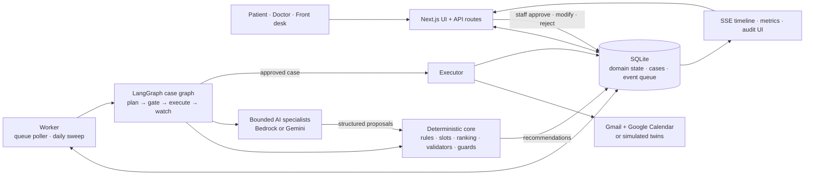
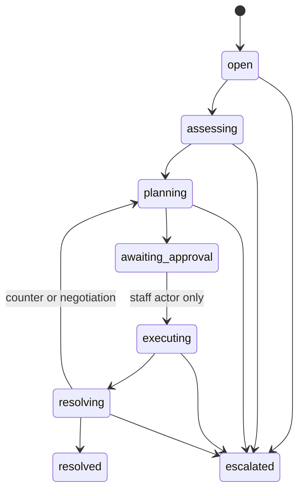

# SchediCare architecture — current implementation

This document describes the implemented capstone system, not a future production design.
SchediCare is a **deterministically orchestrated, human-in-the-loop agentic workflow**:
models interpret ambiguous language and propose bounded decisions; code owns scheduling
correctness, state transitions, approval gates, and side effects.

## 1. System overview

There is no LLM supervisor. `graph/caseGraph.ts` is the orchestrator: a deterministic
LangGraph state machine whose conditional edges read the current case state from SQLite.

Two long-running processes share the database:

- **Next.js application** — patient, doctor, and front-desk interfaces; API routes;
  staff decisions; status, metrics, audit, and SSE endpoints.
- **Worker** — claims events sequentially, runs the daily sweep, starts or resumes case
  graphs, polls known Gmail threads when connected, and executes approved work.

## 2. Ingress and case lifecycle

Events enter the SQLite queue from implemented sources:

- doctor unavailability and patient cancellation API routes;
- the daily sweep for confirmation, no-show-risk, and vacated-slot cases;
- replies on known Gmail threads or simulated patient replies;
- internal resume, constraint-replan, and negotiation events.

The case state machine in `core/cases.ts` is authoritative:

The LangGraph thread sequences `plan → gate → execute → watch`, pauses at staff and
patient boundaries, and is checkpointed in a separate SQLite checkpoint database. The
domain database remains the source of truth, so a resumed graph routes from the case's
current persisted state.

## 3. Where AI is—and is not—authoritative

| Component | Model contribution | Deterministic authority | Practical importance of AI |
|---|---|---|---|
| Constraint extraction | Turns English, Tagalog, or Taglish replies into a structured constraint set; merges prior constraints; attaches evidence text | Guard, Zod schema, canonicalizer, validator, confidence/complexity triage, staff editor | **Core AI value** |
| Negotiation policy | Chooses one move: offer known slots, ask about one computed relaxation, or escalate | Candidate-key guard, valid relaxation fields, turn budget, never-ask-twice rule, approval gate | **Core bounded agency** |
| Continuation drafting | Acknowledges a patient's counter or clarification naturally | Known facts only, content lint, safe template fallback, staff approval | Useful but supporting |
| Assessment | Summarizes blast radius and operational priority | Ground-truth appointment lookup; deterministic fallback | Replaceable/supporting |
| Scheduling | Chooses calls to read-only slot-search tools and packages options | Slot engine revalidates every submitted option; executor validates the selected placement again | Replaceable/supporting |
| Recovery and waitlist packaging | Explains tool-produced ranking | Deterministic scoring, top-choice policy, cross-patient deduplication, staff override | Replaceable/supporting |
| Attendance risk | Selects and explains flags | Rule-based score and factors; deterministic fallback | Replaceable/supporting |

First-contact reschedule offers are rendered from a deterministic template. They do not
use model-written prose. This is intentional: once a task is enumerable, code is safer,
faster, and cheaper.

The most defensible AI story is therefore the reply loop: semantic extraction supplies
meaning that rules cannot reliably recover, and the negotiation policy chooses among a
small, verified action set.

## 4. Agent runtime and tool contracts

`agents/runtime/` provides one provider-neutral tool loop for Claude on Amazon Bedrock
and Gemini. An agent definition contains:

- a system prompt and input prompt builder;
- a set of `ToolDef` objects, each with a Zod input schema and TypeScript function;
- a Zod result schema;
- a step cap and a deterministic or safe-handoff fallback.

The loop binds domain tools plus a terminal `submit_result` tool. Plain-text answers do
not complete a run. Tool inputs and final output must pass their Zod schemas; invalid
results are returned to the model for correction until the step cap is reached.

Representative tools:

| Tool | Inputs | Returns | Authority |
|---|---|---|---|
| `get_affected_appointments` | doctor ID, local date | active appointments plus patient context | Read-only |
| `find_open_slots` | doctor, type, date range, optional time constraints | rule-valid open slots | Read-only |
| `score_no_show` | appointment ID | deterministic score and factor breakdown | Read-only |
| `rank_recovery_options` | appointment ID | scored options and explanation chips | Read-only |
| `submit_result` | agent-specific Zod object | terminal structured result | No side effect |

The constraint extractor and negotiation policy do not need domain tools: their prompts
receive bounded context, and their outputs pass deterministic validation or policy guards.

Current enforcement nuance: scheduling output is revalidated for real availability, and
negotiation slot keys are checked against computed candidates. The runtime does not retain
a byte-for-byte provenance check proving that every scheduling or recovery field was copied
from a preceding tool result. Safety is preserved by validation, staff review, and
execution-time revalidation, but exact tool-output provenance is not yet enforced.

## 5. Approval and side-effect boundary

Agents do not receive Calendar or mail write tools. They create structured recommendations
in `proposed` state.

1. Staff approve, revise to a validator-approved option, or reject with a reason.
2. Only a `staff*` actor may move a case into `executing`.
3. The graph resumes and calls the executor.
4. The executor revalidates calendar placement, creates or updates Calendar events, sends
   mail, and records the outcome.

Initial planning and final approval are case-wide barriers: the graph collects all patient
proposals and waits for the final staff decision before executing the batch. Once execution
finishes, replies and replans are patient-specific; they do not wait for the other patients.
The single FIFO worker nevertheless serializes all queued events, so these independent
patient turns run one at a time in arrival order.

Automated recommendations reach external providers only through the executor. Explicit
human actions—such as direct booking, cancellation, or marking a doctor unavailable—also
write through their API route handlers and are recorded in the audit log.

A deterministic confirmation acknowledgment is the sole gate-exempt outbound message. It
is sent only after the patient's acceptance has already confirmed the appointment.

## 6. Memory and persistence

SchediCare uses task memory, not semantic memory:

- **Domain state:** appointments, messages, recommendations, cases, and events in SQLite.
- **Case working memory:** assessment, slot options, plans, and per-appointment constraint
  sets in the case's JSON metadata.
- **Conversation memory:** accumulated constraints, offer history, asked relaxation fields,
  turn count, and status in the `negotiations` table.
- **Control-flow memory:** LangGraph SQLite checkpoints for pause/resume at approval and
  reply boundaries.
- **Single-run context:** the provider tool loop's message history.

There is no vector database or long-term semantic profile. The workflow needs exact,
case-scoped facts and auditable conversation state; retrieval-style memory would add little
value and create unnecessary privacy and consistency risks.

## 7. Storage model

The main implemented tables are:

- clinic domain: `clinics`, `doctors`, `doctor_rules`, `patients`,
  `attendance_history`, `appointments`, `waitlist`;
- coordination: `events`, `cases`, `case_timeline`, `agent_runs`,
  `recommendations`, `messages`, `negotiations`;
- operations: `audit_log`, `system_status`, `oauth_tokens`;
- simulated integrations: `sim_calendar_events`, `sim_mail`.

SQLite and the sequential worker are deliberate capstone constraints. There are no user,
role, or appointment-type tables.

## 8. Integrations

Calendar and mail each have Google and simulated implementations behind the same interface.

- Calendar supports listing, free/busy checks, create, update, and delete.
- Gmail supports draft creation/update, sending, and polling replies from known threads.
- OAuth tokens remain server-side in SQLite.
- Simulated providers use SQLite and deterministic personas for repeatable demos.
- MCP exposes a readiness/health path only; direct Google APIs are the active integration.

Provider selection is per service. A working model does not imply that Gmail or Calendar
is live; the status UI reports each service separately.

## 9. Observability

- `case_timeline` records plain-language statuses, transitions, recommendations, decisions,
  effects, errors, and non-quiet tool calls/results.
- `agent_runs` records input, output, live/fallback mode, status, step and tool counts,
  tool errors, latency, and error text.
- `audit_log` records attributed triggers, decisions, and effects.
- `system_status` stores provider health and forced-resilience state.
- `/api/feed` polls new timeline rows and streams them to the UI over SSE.

The audit log is append-only by application convention, not immutable database storage.
This is rubric-level observability, not production distributed tracing: there is no
OpenTelemetry backend, alerting, retention policy, token/cost accounting, or direct span
linkage between every timeline tool event and an `agent_runs` row.

## 10. Failure and resilience behavior

| Failure | Current behavior |
|---|---|
| Live model error, quota, timeout, invalid result, or step cap | Marks the provider unhealthy. When fallback is enabled, assessment, scheduling, recovery, risk, and comms use schema-compatible deterministic playbooks. |
| AI unavailable during reply handling | The current router uses the guarded legacy reply classifier for simple intents/counters. Rich compound extraction and the constraint editor are not equivalent in resilience mode. |
| Negotiation model unavailable | The policy fallback escalates to staff with the accumulated context. |
| Invalid or unsafe model proposal | Zod validation, constraint validation, policy guards, content lint, staff approval, and execution-time placement validation constrain it. |
| Google read failure during planning | Marks Calendar unhealthy and retries free/busy through the simulated provider. |
| Gmail draft creation failure | Marks Gmail unhealthy and creates a labeled simulated draft. |
| Gmail send failure after a live draft exists | Retains the draft, records the error, and marks the recommendation failed rather than risking a duplicate send. |
| Worker event failure | One retry, then the event is failed and an associated case is escalated when possible. |
| Worker crash before an event is claimed | Pending events remain in SQLite and can be claimed after restart. |
| Worker crash after an event is marked `processing` | No stale-claim recovery currently exists; the row can remain stuck and needs manual repair/reset. |

Executor rows with `executed_at` are skipped on later passes, but there is no universal
external idempotency key. A crash between an external write and the corresponding database
update remains a production-hardening gap.

## 11. Security and scope limitations

Implemented safeguards include the staff-only state transition, read-only agent tools,
input guards for clinical/upset/injection content, output linting, slot validation, and
minimal scheduling data rather than clinical records.

This v0 is not production-secure:

- there is no authentication or authorization; the UI role switcher and actor strings are
  demo conventions, not verified identities;
- patient contact data and OAuth tokens are stored server-side but are not encrypted at
  rest by the application;
- the audit log is not tamper-proof;
- the system supports one clinic, one sequential worker, and tracked email threads only;
- Gmail push, Calendar webhooks, SMS, phone intake, tenancy enforcement, and horizontal
  worker recovery are not implemented.

## 12. Verification and evidence limits

The automated suite exercises the state machine, validators, providers through test doubles,
approval routes, LangGraph pause/resume, and full recovery flows in fallback/simulated mode.
The constraint corpus separately evaluates the live extractor against a deterministic
baseline.

The extraction corpus is a development set: prompts and labels were iterated against it.
A frozen held-out set and a live-model end-to-end regression run are still needed before
claiming generalized AI reliability.
