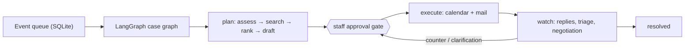

# SchediCare — Riverside Family Clinic

**Agentic appointment disruption recovery for a small outpatient clinic.**
When a doctor calls in sick, SchediCare maps the blast radius, finds rule-valid
alternatives for every affected patient, drafts the outreach, understands the
replies (English or Taglish), and negotiates counter-proposals within strict
bounds — stopping at every consequential step. **SchediCare proposes. Clinic
staff approve.** Nothing reaches a patient or a calendar without an explicit
human decision.

Design principle: **authority scales with verifiability.** Everything
repeatable and checkable is deterministic code — the slot engine, validators,
ranking, the case state machine, reply triage, and the negotiation guards.
LLMs support disruption assessment, read-only slot-search orchestration, and
recovery explanations, and provide the core semantic value in free-text
constraint extraction and bounded negotiation. First-contact offers and
confirmation acknowledgments in the doctor-disruption flow are deterministic
templates. Models draft open-ended continuations and clarifications, plus the
confirmation, preventive, and waitlist outreach flows. Model output flows
through validators and a staff gate before anything consequential happens.

## Quickstart

```bash
npm install                # Node 18.17+ (20/22 recommended)
npm run demo:reset         # seed the 3-patient live-demo world
npm run dev                # terminal 1 — web on http://localhost:3000
npm run worker             # terminal 2 — agent worker
npm run demo:cascade       # trigger it by CLI (or use “I can't come in” in Doctor)
```

`npm run demo` seeds the three-patient world, mirrors active appointments into
the mapped dedicated Google demo calendars, and starts web + worker together.
Before mirroring, it deletes every existing event from those dedicated calendars;
for safety it refuses `primary` or any mapping that is not a secondary calendar
ID ending in `@group.calendar.google.com`.
With `DEMO_NOW=now`, data is anchored around the current Manila time and the
afternoon showcase uses Dr. Santos's next working day. An ISO `DEMO_NOW` keeps
tests and reproducible offline runs deterministic. Demo reset preserves Google
OAuth and doctor-calendar mappings.

Live mode: `AI_PROVIDER=bedrock` runs the agents on **Claude Sonnet 4.6 via
Amazon Bedrock** (the primary demo brain); Gmail and Google Calendar are wired
per [docs/GOOGLE_WORKSPACE_SETUP.md](docs/GOOGLE_WORKSPACE_SETUP.md). Without
keys, everything degrades to deterministic fallbacks and simulated providers
with identical data shapes — degrading to _staff review_, never to dumber
automation ([docs/FALLBACK_MODE.md](docs/FALLBACK_MODE.md)).
For live replies, keep `AUTO_SIMULATE_REPLIES=false` and use a
`DEMO_PATIENT_EMAIL` inbox different from the OAuth-connected clinic Gmail.
See the timed [live demo runbook](docs/DEMO_RUNBOOK.md).

## What it does

- **Disruption cascade** — doctor emergency → assessment (severity, priority,
  no clinical judgment) → validated slot search → deterministic ranking with
  "Why?" chips → drafted offers → **staff approval gate** → executor books
  holds and sends mail → replies tracked to resolution.
- **Constraint understanding** — free-text, Taglish-native replies become
  structured compound constraint sets (dates, weekday allow/exclude, time
  windows, doctor requirements, soft preferences) with evidence quotes, behind
  a clinical-content guard and a validator/canonicalizer.
- **Constraint editor** — staff see extracted constraints per appointment,
  toggle hard/soft, resolve ambiguity, search matching slots, and get
  relaxation hints with computed per-constraint yields when nothing fits.
- **Guarded negotiation** — a closed 3-action policy (offer validated slots /
  ask one clarifying question / escalate), turn budget of 3, never-ask-twice,
  unknown-slot rejection; every outbound goes through the same approval gate.
- **One thread per patient** — all mail lives in a single Gmail conversation
  with proper RFC threading; confirmations get a deterministic same-thread
  acknowledgment (template-only, the one outbound that needs no gate).
- **Quieter work, same pattern** — vacated-slot waitlist backfill, no-show-risk
  preventive outreach, and unconfirmed-visit nudges all wait behind the gate.
- **Observability** — every tool call, transition, and decision lands in a
  per-case timeline (plain language, technical detail behind a toggle) and an
  actor-attributed audit log; `npx tsx scripts/why-not-resolved.ts` explains
  exactly what blocks a resolving case.

## How it works



Each case is a checkpointed LangGraph thread (plan → gate → execute → watch)
whose edges route on database state; the state machine in `core/cases.ts`
makes `→ executing` a staff-only transition. The full workflow — which parts
are LLM, which are deterministic, and where the branches and loops live — is
diagrammed in [docs/AGENTIC_WORKFLOW.md](docs/AGENTIC_WORKFLOW.md).

## Verification

```bash
npm run typecheck && npm test   # 106 tests across 11 suites
npm run build                   # production build
npm run eval:constraints        # extraction vs deterministic baseline
```

Constraint extraction on the 66-case labeled dev corpus (compound, negation,
relative dates, Taglish, doctor preferences, mixed clinical): **100% full
match** with guard 4/4, vs **34%** for the corrected deterministic rules
baseline on the same scorer. _Dev-set figure_ — the prompt and labels were
iterated on these cases; a frozen held-out set is the next evaluation step.
Details and history: [docs/TEST_REPORT.md](docs/TEST_REPORT.md),
[docs/EVALUATION.md](docs/EVALUATION.md), [PROJECT_STATUS.md](PROJECT_STATUS.md).

## Scope & limitations (v0, deliberately)

One clinic, two doctors, one worker process, no authentication (role switcher;
the staff-only gate checks an actor string), configurable live/fixed clock. Intake is
**email on tracked threads only** — mailbox-wide intake, SMS, and phone are
future integrations, not redesigns: the extractor consumes text, the
negotiator consumes constraint sets, and the gates consume recommendations,
none of which know the channel. Ranking and negotiation weights are
hand-tuned, not learned. Extraction accuracy carries the dev-set caveat above.
The agent mandate is scheduling operations, never medicine: inbound clinical
content quarantines to a person, outbound drafts are linted
([docs/SECURITY_AND_SCOPE.md](docs/SECURITY_AND_SCOPE.md)).

## Repo map

```
app/            Next.js App Router — pages (/book /doctor /ops /settings) + API routes
graph/          LangGraph case lifecycle (plan → gate → execute → watch) + event dispatch
agents/         Assessment, scheduling, recovery, comms, risk, constraint extractor, negotiation policy
agents/runtime/ Provider-agnostic tool loop (Bedrock / Gemini) + Zod validation + fallback dispatch
core/           Slot engine, validators, constraints, ranking, negotiations, case state machine, audit, clock, db
integrations/   Google Calendar/Gmail providers, simulated twins, OAuth, MCP transport
worker/         Event queue, pipeline steps, executor, reply handling + triage, negotiation runner, daily sweep
sim/            Deterministic seed + reply personas
tests/          12 suites, 116 tests — incl. cascade E2E, LangGraph lifecycle, constraints + negotiation guards
eval/           Constraint corpus (66 labeled replies) + baseline scorer + metric harness
docs/           Setup guides, runbook, agentic workflow, evaluation, security & scope
```

## Documentation

- [docs/AGENTIC_WORKFLOW.md](docs/AGENTIC_WORKFLOW.md) — the agent graph: who does what, LLM vs deterministic
- [PROJECT_STATUS.md](PROJECT_STATUS.md) — what shipped, deviations, known limitations
- [docs/DEMO_RUNBOOK.md](docs/DEMO_RUNBOOK.md) — presenter script with fallback drills
- [docs/TEST_REPORT.md](docs/TEST_REPORT.md) · [docs/EVALUATION.md](docs/EVALUATION.md) — reproduced numbers
- [docs/NEGOTIATION.md](docs/NEGOTIATION.md) · [docs/LANGGRAPH.md](docs/LANGGRAPH.md) — design notes
- [ARCHITECTURE.md](ARCHITECTURE.md) · [PRODUCT.md](PRODUCT.md) — system + product overviews
- [DESIGN.md](DESIGN.md) · [IMPLEMENTATION_PLAN.md](IMPLEMENTATION_PLAN.md) — **historical** pitch-era plans, kept for the record
