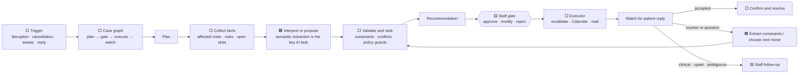
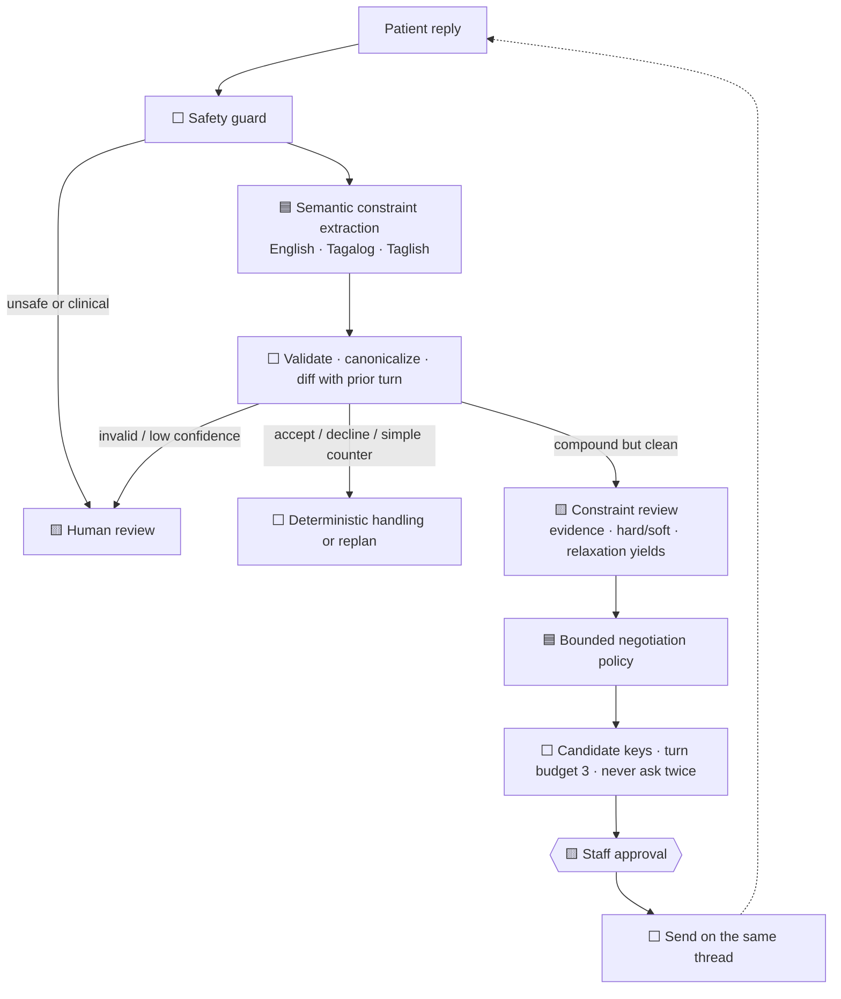

# The agentic workflow

SchediCare is a **gated agentic workflow**, not an autonomous multi-agent hierarchy.
LangGraph and the case state machine control the sequence. Models operate only at
open-ended language and decision points; deterministic code validates every consequential
proposal, and staff approve outbound actions.

**Legend:** 🟦 AI judgment · ⬜ deterministic code · 🟨 human decision

## Presentation diagram

The graph is multi-step and stateful, but the model does not control the graph. It cannot
skip the approval gate or call Calendar and Gmail directly.

For a multi-patient disruption, initial planning and its approval gate are case-wide
barriers: every proposal is collected before staff approve the batch, and execution starts
only after the final decision. Later replies and replans are patient-specific, so one
patient never waits for the others to reply. They are still processed serially by the
single FIFO worker, one queued event at a time.

## The reply loop—the strongest AI contribution

The extractor turns messy language into an auditable `SchedulingConstraintSet`: hard
requirements, soft preferences, evidence quotes, confidence, unresolved statements, and
the full set merged across turns. This is the part that the deterministic baseline handles
poorly and the model materially improves.

The negotiation model has only three actions:

1. offer one to three slots by keys produced by deterministic search;
2. ask one clarification about a computed relaxation;
3. escalate to staff.

Code rejects unknown slots or constraint fields, prevents asking the same question twice,
and forces escalation after three patient-facing rounds.

## Who does what, and why

| Component | Boundary | Design purpose |
|---|---|---|
| Orchestrator | ⬜ Deterministic | LangGraph sequences persisted case states and human gates. Routing and authorization must be repeatable, so no model decides which lifecycle edge runs. |
| Assessment | 🟦 AI with deterministic fallback | Condenses a multi-patient disruption into an operational brief ordered by visit type, timing, and continuity. AI reduces staff reading effort; it performs no clinical triage and is not required for correctness. |
| Scheduling | 🟦 AI using ⬜ deterministic tools | Chooses useful searches when constraints vary. The slot engine—not the model—produces and revalidates every time against rules, conflicts, buffers, and hard capacity caps. |
| Recovery | 🟦 AI over ⬜ deterministic ranking | Packages the code-ranked options into an understandable recommendation. Code owns the order so equivalent cases remain consistent; AI contributes explanation only. |
| Constraint extractor | 🟦 AI followed by ⬜ validation | Converts English, Tagalog, and Taglish replies into structured scheduling constraints. This is the primary semantic capability; code validates, canonicalizes, and selects the safe routing lane. |
| Negotiator | 🟦 Bounded AI inside ⬜ guards | Chooses whether to offer validated slots, ask one clarification, or hand off. Code restricts candidate keys, fields, repeated questions, and the three-turn budget. |
| Communications | Mixed | Templates own enumerable first-contact and confirmation messages; AI drafts genuinely open-ended counter-offer language. Lint and staff approval apply before anything is sent. |
| Risk | 🟦 AI over ⬜ deterministic scoring | Code calculates attendance-risk scores and bands; AI provides a factor-grounded attention summary. It is a supporting capability, not an authority over scheduling. |
| Executor | ⬜ Deterministic | Revalidates and performs approved Calendar and mail effects. Models cannot write to external systems directly. |
| Staff | 🟨 Human authority | Approves, modifies, rejects, or manually handles every consequential recommendation. |

The system is deliberately hybrid rather than fully LLM-controlled. Models are useful
where meaning is open-ended; state transitions, policy, calculations, slot validity, and
external writes are enumerable and therefore stay in code. This keeps equivalent cases
repeatable and prevents probabilistic text generation from becoming operational authority.

## Activity summaries

The case timeline is one persisted audit stream used by the staff feed, technical trace,
and evaluation. Its summaries are concise captions for human observability: they do not
feed routing, slot validation, ranking, or execution, and they are not hidden
chain-of-thought. The default view omits tool/runtime detail; **Technical detail** exposes
the recorded agent mode, tool calls, results, and actor labels when an engineer needs them.

## Memory design

- SQLite is the operational source of truth.
- LangGraph checkpoints remember where each case is paused.
- Case metadata stores per-appointment extracted constraints and planning results.
- The negotiation ledger stores accumulated constraints, offered slots, asked questions,
  outcomes, and the turn count.
- No vector memory is used because this workflow needs exact case facts, not semantic recall.

## Resilience mode, stated precisely

The initial disruption pipeline can run on deterministic playbooks with the same broad
recommendation shapes. Calendar and mail also have clearly labeled simulated twins.

The rich reply path is not identical without AI. When the model is unavailable, simple
replies use the guarded legacy classifier; compound constraint extraction is unavailable,
and the negotiation policy escalates to staff. The safe claim is therefore:

> Resilience mode preserves the scheduling workflow and approval gates. Live AI supplies
> the richer semantic extraction and negotiation behavior.

## Defensible claim

SchediCare is agentic because it observes case state, uses tools, produces structured
decisions, maintains memory, loops on patient responses, and can act through external
systems after approval. Its defensibility comes from the combination of **semantic AI at
ambiguous joints** and **deterministic authority everywhere correctness matters**—not from
the number of agents.
