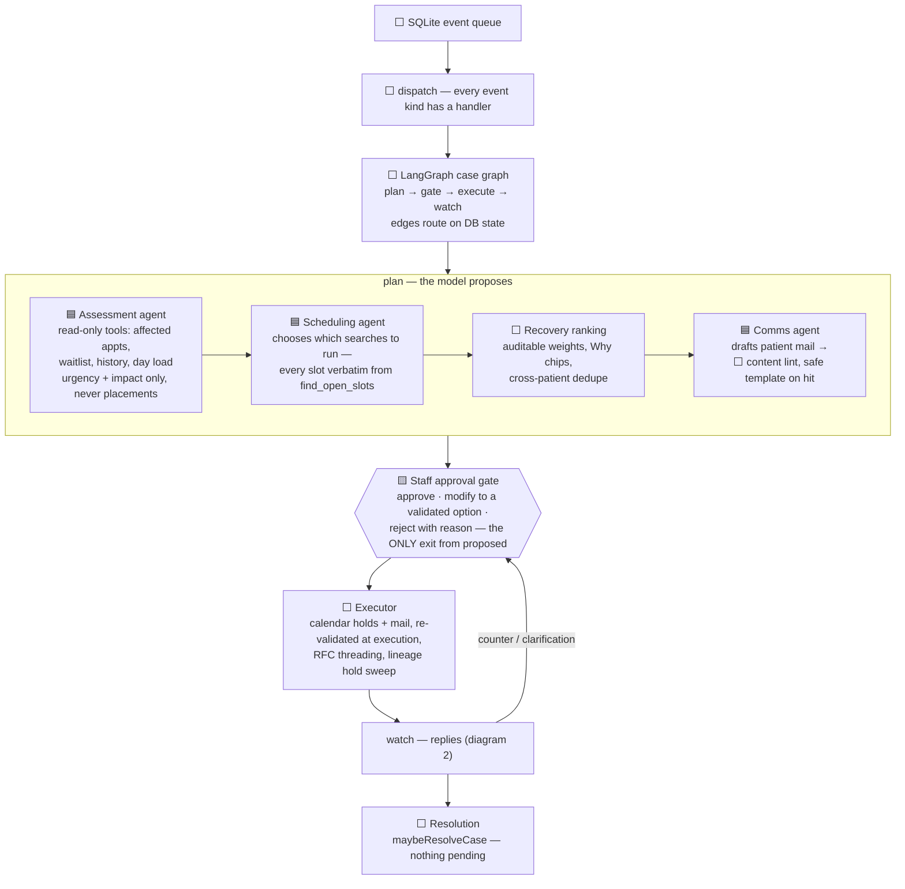
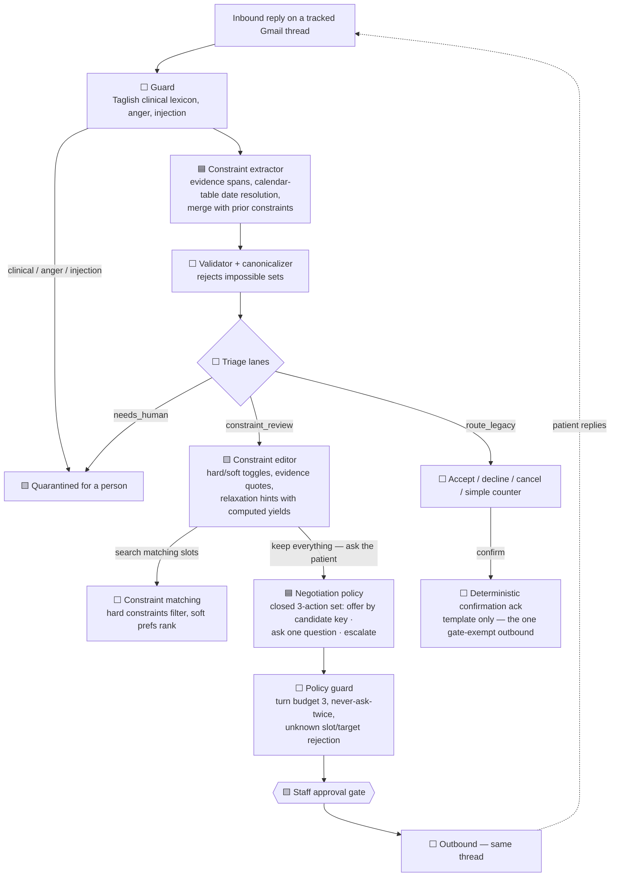

# The agentic workflow

This is the diagram behind the "agentic tree" slide, and the honest answer to
"is this a tree or a pipeline?": **neither, exactly — it is a gated graph.**
There is no LLM supervisor delegating to sub-agents; orchestration is a
deterministic state machine (LangGraph, edges routed on database state), and
that is deliberate — the thesis is that authority scales with verifiability,
so the _spine_ must be code. The plan phase runs specialists in a fixed
sequence (pipeline-like); the reply path _branches_ (triage lanes, a closed
negotiation action set) and _loops_ (negotiation turns, counter-proposal
replans) — graph-like. Every path out of a model converges on the same
choke point: the staff approval gate.

**Legend** — 🟦 LLM (proposes) · ⬜ deterministic code (disposes) · 🟨 human.

## 1. Case lifecycle — one case, end to end

The state machine (`core/cases.ts`) enforces the gate structurally: a
transition into `executing` requires a `staff*` actor, escalation never
revokes a pending approval, and agents can only _request_ transitions.

## 2. Reply path — understanding, triage, negotiation

## Who does what

| Component                             | Kind    | Tools / inputs                                                                | Fallback when AI is down        |
| ------------------------------------- | ------- | ----------------------------------------------------------------------------- | ------------------------------- |
| Assessment                            | 🟦 LLM  | read-only: affected appointments, waitlist, patient history, day load         | deterministic priority playbook |
| Scheduling                            | 🟦 LLM  | `find_open_slots` (slots verbatim; the agent only picks searches + narrative) | deterministic search plan       |
| Recovery ranking                      | ⬜ code | validated slots, auditable weights                                            | n/a — always deterministic      |
| Comms drafting                        | 🟦 LLM  | context JSON (times, doctors) — never invents facts                           | safe templates                  |
| Reply guard                           | ⬜ code | Taglish clinical lexicon                                                      | n/a                             |
| Constraint extractor                  | 🟦 LLM  | reply text, calendar table, prior constraints                                 | review handoff — never regex    |
| Validator / triage / diff             | ⬜ code | extracted sets                                                                | n/a                             |
| Negotiation policy                    | 🟦 LLM  | constraint set, candidate slots, relaxation counts                            | escalate to staff, always       |
| Policy guard, state machine, executor | ⬜ code | —                                                                             | n/a                             |

Fallbacks degrade to **staff review, never to dumber automation** — the same
schemas, a person in the loop.
